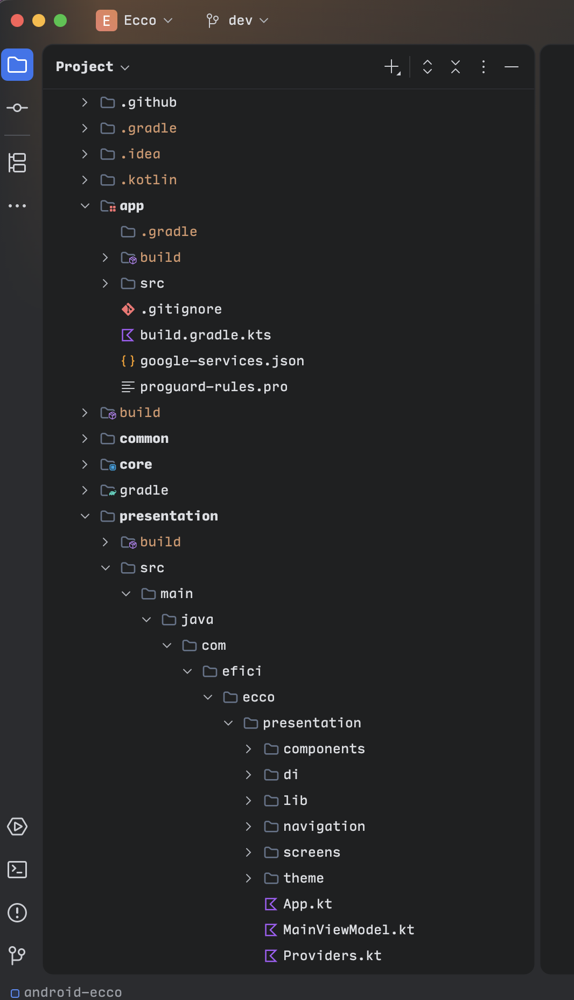

# Symbols Icons for JetBrains


[](https://plugins.jetbrains.com/plugin/31168-symbols-icons)
[](https://plugins.jetbrains.com/plugin/31168-symbols-icons)

<!-- Plugin description -->
<p>A minimal file and folder icon theme for JetBrains IDEs.</p>
<p>Based on <a href="https://github.com/miguelsolorio/vscode-symbols">vscode-symbols</a> by Miguel Solorio.</p>
<!-- Plugin description end -->

## Preview

<p align="center">
	
</p>

## Installation

### Plugin Marketplace

1. Head to the [Plugin Marketplace](https://plugins.jetbrains.com/plugin/31168-symbols-icons/reviews) (Settings > Plugins > Marketplace)
2. Search for "Symbols Icons"
3. Install Plugin

### Manual
Download the latest release and import it with Settings > Plugins > ⚙️ > Install plugin from disk....

## Development

```zsh
deno task build
./gradlew --no-daemon test
./gradlew --no-daemon buildPlugin
```

## Release

```zsh
deno task build
git --no-pager diff --exit-code -- src/main/kotlin/com/github/sebastiandotdev/symbols/Icons.kt src/main/resources/symbols/icons
./gradlew --no-daemon test
./gradlew --no-daemon buildPlugin
```

---
Based on the [IntelliJ Platform Plugin Template](https://github.com/JetBrains/intellij-platform-plugin-template).
